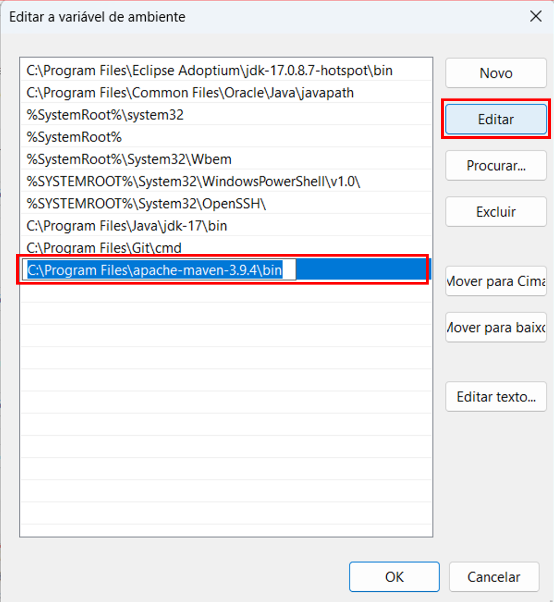

# Gerenciamento de Dependências e Build com Maven

 

## O que é o Maven?
Maven, palavra <a href="https://en.wikipedia.org/wiki/Maven">iídiche</a> que significa acumulador de conhecimento, ferramenta usada para construir e gerenciar projetos baseado em Java. Com o Maven é possível, construir projetos de forma padrão, ter uma definição clara do que consiste o projeto, publicar informações do projeto e ter uma maneira de compartilhar JARs entre vários projetos.

## Instalando e configurando o Apache Maven no Windows
### Requisitos de sistema
Maven 3.9+ requer Kit de Desenvolvimento Java (JDK) 8 ou superior para ser executado.

Verificar se o Java está instalado: no prompt de comando digitar:
~~~CLI
java -version

O retorno deve ser algo como:
openjdk version "17.0.8" 2023-07-18
OpenJDK Runtime Environment Temurin-17.0.8+7 (build 17.0.8+7)
OpenJDK 64-Bit Server VM Temurin-17.0.8+7 (build 17.0.8+7, mixed mode, sharing)
~~~
Acessar o Maven no site: https://maven.apache.org/download.cgi em download clicar no link de Binary zip archive (apache-maven-3.9.4-bin.zip).

 Após o download descompactar, o arquivo .zip em um diretório local, o maven é um arquivo compactado. Após descompactá-lo fazer a configuração da **variável de ambiente**:
 No botão pesquisar da barra de tarefas do Windows, digitar variáveis de ambiente e clicar em **Editar as variáveis de ambiente do sistema**. Na box **Propriedade do sistema**, opção **Avançado**, clicar em **Variáveis de Ambiente**, em seguida selecionar a variável **Path** de Variáveis de sistema e clicar em **Editar** e colar o caminho onde foi descompactado o arrquivo .zip baixado, o endereco deve conter até a pasta bin: C:\Program Files\apache-maven-3.9.4\bin
 
  

Feito esses passos, abrir novamente o prompt de comando e digitar o comando:
~~~CLI
mvn -version

O retorno deve ser algo como:
Apache Maven 3.9.4 (dfbb324ad4a7c8fb0bf182e6d91b0ae20e3d2dd9)
Maven home: C:\Program Files\apache-maven-3.9.4
Java version: 17.0.8, vendor: Eclipse Adoptium, runtime: C:\Program Files\Eclipse Adoptium\jdk-17.0.8.7-hotspot
Default locale: pt_BR, platform encoding: Cp1252
OS name: "windows 11", version: "10.0", arch: "amd64", family: "windows"
~~~

## Entendendo o arquivo pom.xml
+ POM – **Project Object Model**
+ Unidade fundamental de trabalho
+ Formato XML
+ Detalha o projeto
+ Detalha como construir o projeto
+ Maven sempre procura pelo pom.xml para realizar sua execução
